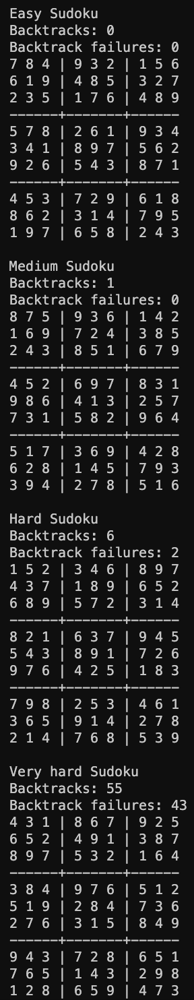

# TDT4136-Assignment-4-Constraint-Satisfaction-Problems
Implementation of a general solver for Constraint Satisfaction Problems using backtracking search and the arc-consistency algorithm AC-3. The program solves Sudoku boards of varying difficulty.

## Run program
`python Assignment.py`

## Brief comments about the result in the consistency checks
As seen from the results shown in the image below, the amount of backtracks and failed backtracks increases with the Sudoku board difficulty. This makes sense, by theory, since a more difficult board gives a greater amount of legal values for each of the variables. With less starting variables already decided, less legal values can be deleted at the start. 

## Functions implememnted
`backtrack(self, assignment)`  
`select_unassigned_variable(self, assignment)` 
`inference(self, assignment, queue)` 
`revise(self, assignment, i, j)`

## Solutions

## Want to test other Sudoku?
1. Add your own sudoku .txt file
2. At `main()`: replace e.g. easy.txt at `csp = create_sudoku_csp("easy.txt")` with your file name.
